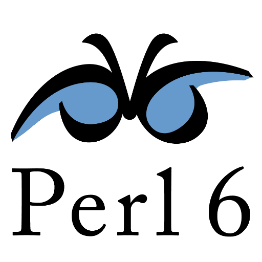

<strong>Language Independent Validation Rules (v2.0) </strong>
<a class="github-button" href="https://github.com/koorchik/LIVR" data-icon="octicon-star" data-size="large" data-show-count="true" aria-label="Star koorchik/LIVR on GitHub">Star</a>

## Validator meets the following requirements:

1. Rules are declarative and language independent
2. Any number of rules for each field
3. Validator should return together errors for all fields
4. Exclude all fields that do not have validation rules described
5. Possibility to validate complex hierarchical structures
6. Easy to describe and understand validation
7. Returns understandable error codes \(neither error messages nor numeric codes\)
8. Easy to implement own rules \(usually you will have several in every project\)
9. Rules should be able to change results output \("trim", "nested\_object", for example\)
10. Multipurpose \(user input validation, configs validation, contracts programming etc\)
11. Unicode support

## Try online

* [Online JavaScript playground](http://webbylab.github.io/livr-playground/)
* [Online multi-language playground](http://livr-multi-playground.webbylab.com/)

## Existing implemenations

    

        
        

            <a href="https://travis-ci.org/koorchik/js-validator-livr">
                 
            </a>
            <a href="https://github.com/koorchik/js-validator-livr">
                JavaScript (LIVR 2.0)
            </a> 
            available at
            <a href="https://www.npmjs.com/package/livr">
                npm,
            </a> 
            maintainer
            <a href="https://github.com/koorchik" rel="nofollow">@koorchik</a>
        

    

    

        
        

            <a href="https://travis-ci.org/koorchik/Validator-LIVR">
                 
            </a>
            <a href="https://github.com/koorchik/Validator-LIVR">
                Perl (LIVR 2.0)
            </a> 
            available at
            <a href="https://metacpan.org/pod/Validator::LIVR">
                CPAN,
            </a> 
            maintainer
            <a href="https://github.com/koorchik" rel="nofollow">@koorchik</a>
        

    

    

        
        

            <a href="https://travis-ci.org/koorchik/perl6-livr">
                 
            </a>
            <a href="https://github.com/koorchik/perl6-livr">
                Perl (LIVR 2.0)
            </a> 
            available at
            <a href="https://modules.perl6.org/dist/LIVR:cpan:KOORCHIK">
                CPAN,
            </a> 
            maintainer
            <a href="https://github.com/koorchik" rel="nofollow">@koorchik</a>
        

    

    

        
        

            <a href="https://travis-ci.org/WebbyLab/php-validator-livr">
                 
            </a>
            <a href="https://github.com/WebbyLab/php-validator-livr">
                PHP (LIVR 2.0)
            </a> 
            available at
            <a href="https://packagist.org/packages/validator/livr">
                packagist,
            </a> 
            maintainer
            <a href="https://github.com/WebbyLab" rel="nofollow">@WebbyLab</a>
        

    

    

        
        

            <a href="https://travis-ci.org/asholok/python-validator-livr">
                 
            </a>
            <a href="https://github.com/asholok/python-validator-livr">
                Python (LIVR 2.0)
            </a> 
            available at
            <a href="https://pypi.python.org/pypi/LIVR">
                pypi,
            </a> 
            maintainer
            <a href="https://github.com/asholok" rel="nofollow">@asholok</a>
        

    

    

        
        

            <a href="https://travis-ci.org/Prots/olifer">
                 
            </a>
            <a href="https://github.com/Prots/olifer">
                OLIFER, Erlang (LIVR 2.0),
            </a> 
            maintainer
            <a href="https://github.com/Prots" rel="nofollow">@Prots</a>
        

    

    

        
        

            <a href="https://travis-ci.org/erlangbureau/liver">
                 
            </a>
            <a href="https://github.com/erlangbureau/liver">
                LIVER, Erlang (LIVR 2.0),
            </a> 
            maintainer
            <a href="https://github.com/erlangbureau" rel="nofollow">@erlangbureau</a>
        

    

    

        
        

            <a href="https://github.com/vlbaluk/java-validator-livr">
                Java (LIVR 2.0),
            </a> 
            maintainer
            <a href="https://github.com/vlbaluk" rel="nofollow">@vlbaluk</a>
        

    

    

        
        

            <a href="https://travis-ci.org/fuksito/ruby-livr">
                 
            </a>
            <a href="https://github.com/fuksito/ruby-livr/">
                Ruby (LIVR 2.0),
            </a> 
            available at
            <a href="https://rubygems.org/gems/ruby-livr">
                rubygems,
            </a> 
            maintainer
            <a href="https://github.com/fuksito" rel="nofollow">@fuksito</a>
        

    

    

        
        

            <a href="https://travis-ci.org/maktwin/ruby-validator-livr">
                 
            </a>
            <a href="https://github.com/maktwin/ruby-validator-livr">
                Ruby (LIVR 0.4, previous version),
            </a> 
            available at
            <a href="https://rubygems.org/gems/livr">
                rubygems,
            </a> 
            maintainer
            <a href="https://github.com/maktwin" rel="nofollow">@maktwin</a>
        

    

    

        
        

            <a href="https://travis-ci.org/fperrad/lua-LIVR">
                 
            </a>
            <a href="https://github.com/fperrad/lua-LIVR">
                Lua (LIVR 2.0),
            </a> 
            maintainer
            <a href="https://github.com/fperrad" rel="nofollow">@fperrad</a>
        

    

## Documentation {#documentation}

* [Introduction](introduction.md)
* [Validation Rules](validation-rules.md)
* [Rules aliasing](rules-aliasing.md)
* [How to contribute](how-to-contribute.md)
* [Changes](changes.md)
* [License](license-and-copyright.md)

## Posts and talks about LIVR

* ["LIVR - Data Validation Without Any Issues" from LIVR creator](http://blog.webbylab.com/language-independent-validation-rules-library/)
* [Talk on LIVR 2.0 at the OSDN-UA 2017 conference (RU)](https://www.youtube.com/watch?v=QlwcG3N_rmw&feature=youtu.be)
* [Article on LIVR & Perl implementation in the PragmaticPerl magazine (RU)](http://pragmaticperl.com/issues/05/pragmaticperl-05-livr-language-independent-validation-rules-%D0%BD%D0%B5%D0%B7%D0%B0%D0%B2%D0%B8%D1%81%D0%B8%D0%BC%D1%8B%D0%B5-%D0%BE%D1%82-%D1%8F%D0%B7%D1%8B%D0%BA%D0%B0-%D0%BF%D1%80%D0%B0%D0%B2%D0%B8%D0%BB%D0%B0-%D0%B2%D0%B0%D0%BB%D0%B8%D0%B4%D0%B0%D1%86%D0%B8%D0%B8.html)

## Examples

* [Simple registration data](http://webbylab.github.io/livr-playground/#%7B%22rules%22%3A%22%7B%5Cn%20%20%20%20name%3A%20'required'%2C%5Cn%20%20%20%20email%3A%20%5B'required'%2C%20'email'%5D%2C%5Cn%20%20%20%20gender%3A%20%7B%20one_of%3A%20%5B%5B'male'%2C%20'female'%5D%5D%20%7D%2C%5Cn%20%20%20%20phone%3A%20%7Bmax_length%3A%2010%7D%2C%5Cn%20%20%20%20password%3A%20%5B'required'%2C%20%7Bmin_length%3A%2010%7D%20%5D%2C%5Cn%20%20%20%20password2%3A%20%7B%20equal_to_field%3A%20'password'%20%7D%5Cn%7D%22%2C%22data%22%3A%22%7B%5Cn%20%20%20%20name%3A%20'John'%2C%5Cn%20%20%20%20email%3A%20'john%40mail.com'%2C%5Cn%20%20%20%20gender%3A%20'male'%2C%5Cn%20%20%20%20phone%3A%20'%2B22221212'%2C%5Cn%20%20%20%20password%3A%20'mypassword1'%2C%5Cn%20%20%20%20password2%3A%20'mypassword1'%5Cn%7D%22%7D)
* [Simple validation of nested object](http://webbylab.github.io/livr-playground/#%7B%22rules%22%3A%22%7B%5Cn%20%20%20%20name%3A%20'required'%2C%5Cn%20%20%20%20phone%3A%20%7Bmax_length%3A%2010%7D%2C%5Cn%20%20%20%20address%3A%20%7B%20'nested_object'%3A%20%7B%5Cn%20%20%20%20%20%20%20%20city%3A%20'required'%2C%20%5Cn%20%20%20%20%20%20%20%20zip%3A%20%5B'required'%2C%20'positive_integer'%5D%5Cn%20%20%20%20%7D%7D%5Cn%7D%22%2C%22data%22%3A%22%7B%5Cn%20%20%20%20name%3A%20%5C%22Michael%5C%22%2C%5Cn%20%20%20%20phone%3A%20%5C%220441234567%5C%22%2C%5Cn%20%20%20%20address%3A%20%7B%5Cn%20%20%20%20%20%20%20%20city%3A%20%5C%22Kiev%5C%22%2C%20%5Cn%20%20%20%20%20%20%20%20zip%3A%20%5C%2230552%5C%22%5Cn%20%20%20%20%7D%5Cn%7D%22%7D)
* [Simple list validation](http://webbylab.github.io/livr-playground/#%7B%22rules%22%3A%22%7B%5Cn%20%20%20%20order_id%3A%20%5B'required'%2C%20'positive_integer'%5D%2C%5Cn%20%20%20%20product_ids%3A%20%7B%20%5Cn%20%20%20%20%20%20%20'list_of'%3A%20%5B%20'required'%2C%20%20'positive_integer'%20%5D%5Cn%20%20%20%20%7D%5Cn%7D%22%2C%22data%22%3A%22%7B%5Cn%20%20%20%20order_id%3A%2010455%2C%5Cn%20%20%20%20product_ids%3A%20%5B3455%2C3456%2C3566%5D%5Cn%7D%22%7D)
* [Validating list of objects](http://webbylab.github.io/livr-playground/#%7B%22rules%22%3A%22%7B%5Cn%20%20%20%20order_id%3A%20%5B'required'%2C%20'positive_integer'%5D%2C%5Cn%20%20%20%20products%3A%20%5B%20'not_empty_list'%2C%20%7B%20'list_of_objects'%3A%20%7B%5Cn%20%20%20%20%20%20%20%20product_id%3A%20%5B'required'%2C'positive_integer'%5D%2C%5Cn%20%20%20%20%20%20%20%20quantity%3A%20%5B'required'%2C%20'positive_integer'%5D%5Cn%20%20%20%20%7D%7D%5D%5Cn%7D%22%2C%22data%22%3A%22%7B%5Cn%20%20%20%20order_id%3A%2010345%2C%5Cn%20%20%20%20products%3A%20%5B%7B%5Cn%20%20%20%20%20%20%20%20product_id%3A%203455%2C%5Cn%20%20%20%20%20%20%20%20quantity%3A2%5Cn%20%20%20%20%7D%2C%7B%5Cn%20%20%20%20%20%20%20%20product_id%3A%203456%2C%5Cn%20%20%20%20%20%20%20%20quantity%3A3%5Cn%20%20%20%20%7D%5D%5Cn%7D%22%7D)
* [Validating list of different objects](http://webbylab.github.io/livr-playground/#%7B%22rules%22%3A%22%7B%5Cn%20%20%20%20order_id%3A%20%5B'required'%2C%20'positive_integer'%5D%2C%5Cn%20%20%20%20products%3A%20%5B'required'%2C%20%7B%20'list_of_different_objects'%3A%20%5B%5Cn%20%20%20%20%20%20%20%20product_type%2C%20%7B%5Cn%20%20%20%20%20%20%20%20%20%20%20%20material%3A%20%7B%5Cn%20%20%20%20%20%20%20%20%20%20%20%20%20%20%20%20product_type%3A%20'required'%2C%5Cn%20%20%20%20%20%20%20%20%20%20%20%20%20%20%20%20material_id%3A%20%5B'required'%2C%20'positive_integer'%5D%2C%5Cn%20%20%20%20%20%20%20%20%20%20%20%20%20%20%20%20quantity%3A%20%5B'required'%2C%20%7B'min_number'%3A%201%7D%20%5D%2C%5Cn%20%20%20%20%20%20%20%20%20%20%20%20%20%20%20%20warehouse_id%3A%20'positive_integer'%5Cn%20%20%20%20%20%20%20%20%20%20%20%20%7D%2C%5Cn%20%20%20%20%20%20%20%20%20%20%20%20service%3A%20%7B%5Cn%20%20%20%20%20%20%20%20%20%20%20%20%20%20%20%20product_type%3A%20'required'%2C%5Cn%20%20%20%20%20%20%20%20%20%20%20%20%20%20%20%20name%3A%20%5B'required'%2C%20%7B'max_length'%3A%2020%7D%20%5D%5Cn%20%20%20%20%20%20%20%20%20%20%20%20%7D%5Cn%20%20%20%20%20%20%20%20%7D%5Cn%20%20%20%20%5D%7D%5D%5Cn%7D%22%2C%22data%22%3A%22%7B%5Cn%20%20%20%20order_id%3A%2010455%2C%5Cn%20%20%20%20products%3A%20%5B%7B%20%5Cn%20%20%20%20%20%20%20%20product_type%3A%20'material'%2C%5Cn%20%20%20%20%20%20%20%20material_id%3A%20345%2C%5Cn%20%20%20%20%20%20%20%20quantity%3A%20%205%2C%5Cn%20%20%20%20%20%20%20%20warehouse_id%3A%2024%5Cn%20%20%20%20%7D%2C%7B%5Cn%20%20%20%20%20%20%20%20product_type%3A%20'service'%2C%5Cn%20%20%20%20%20%20%20%20name%3A%20'Clean%20filter'%5Cn%20%20%20%20%7D%5D%5Cn%7D%22%7D)
